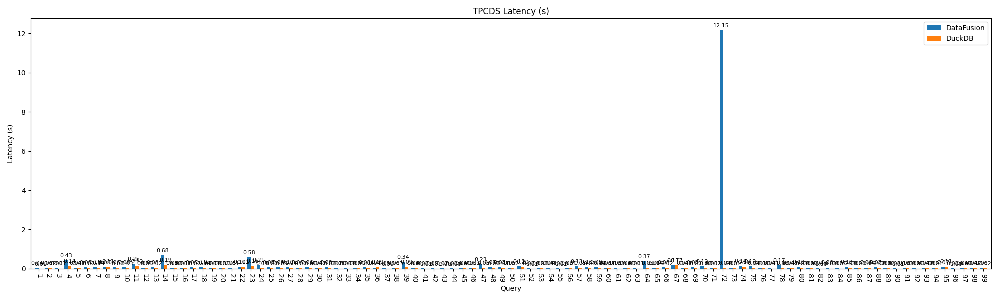
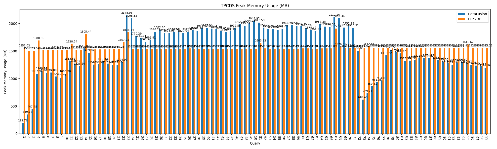
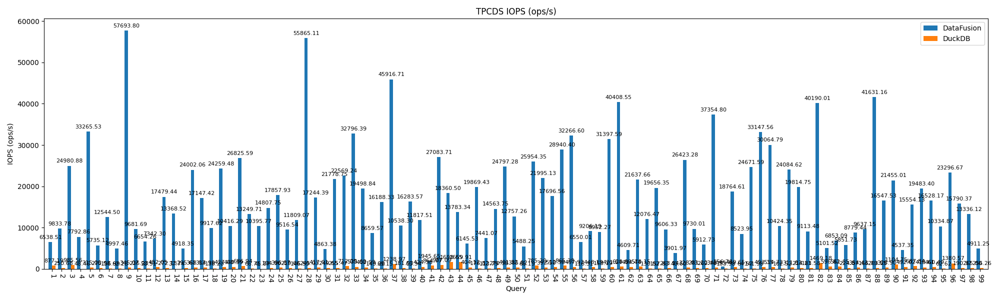

# Tese

This repository ensures the contents of my thesis are easily reproducible to be verified by external entities. It provides benchmark results for two query benchmarking tools: **TPC-H** and **TPC-DS**. The results include plots for latency, memory usage, and IOPS.

## Setup

To run the benchmarks, execute the following command:

```bash
docker compose down && docker compose build && docker compose up -d
```

## Results

### TPC-H


### TPC-DS






